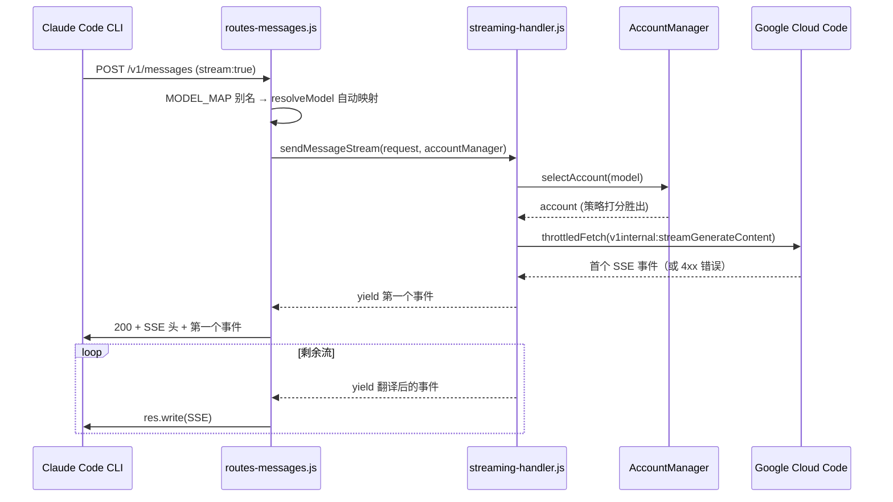
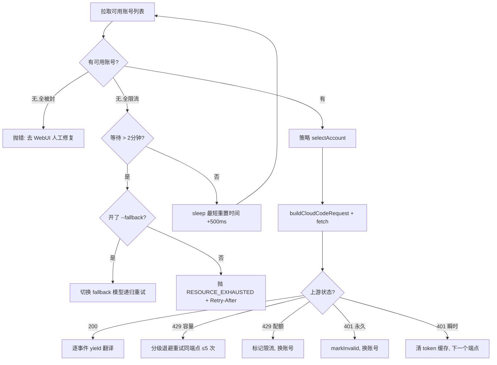

# 📖 agy-cc-proxy 源码全景解析

## 🌟 小白导读

**一句话大白话：** 这个项目是一台"翻译 + 排队叫号"的服务器：前端说 Anthropic 方言（Claude Code CLI 的 Messages API），后端只听得懂 Google 方言（Cloud Code `v1internal:streamGenerateContent`），它站在中间逐字翻译，还要在多个 Google 账号之间聪明地挑一个"今天额度还没用完"的来干活。

**生活类比：** 把它想象成一家只接待外宾的国际医院挂号台——病人（Claude Code CLI）说的是英语（Anthropic 协议），医院内部的医生只讲中文（Cloud Code 内部接口），挂号员（本代理）要做三件事：①同声传译；②从一排医生里挑一个不在休息/没被打封条（限流/封号）的；③出问题时要么换医生、要么告诉病人"2 点后再来"（Retry-After）。

**读前预期：**
- 读完"架构全景"后，你将能理解：一条请求从进来到出去经过哪些模块、每个模块管什么。
- 读完"关键业务流程图解"后，你将能看懂：流式请求为何"先拉第一个事件再发 200 头"，以及多账号重试的完整决策树。
- 读完"难点突破"后，你将彻底搞清楚：跨模型 thinking 签名互译、429 去重/单飞探针、schema 多相消毒这三块最硬的骨头。

---

## 📋 目录

- [项目概述与技术栈](#项目概述与技术栈)
- [目录结构](#目录结构)
- [架构全景（附生活类比）](#架构全景附生活类比)
- [入口与初始化流程](#入口与初始化流程)
- [关键业务流程图解](#关键业务流程图解)
- [核心源码剥洋葱（三层深度）](#核心源码剥洋葱三层深度)
- [错误处理与安全边界](#错误处理与安全边界)
- [关键类型与接口定义](#关键类型与接口定义)
- [难点突破（逐个攻克）](#难点突破逐个攻克)
- [为什么要这样设计？](#为什么要这样设计)
- [避坑指南](#避坑指南)

（正文按章节增量追加中）

---

## 🎯 项目概述与技术栈

本仓库是一个 Node.js 代理服务器：对外暴露标准 **Anthropic Messages API**（`/v1/messages`），让 Claude Code CLI 无感地把 Gemini / Claude 模型（由 Google Cloud Code 内部接口 `v1internal:streamGenerateContent` 提供）当官方 API 用。请求管道**无状态**——除账号/配额/用量落盘持久化外，任何请求级状态不跨请求存活。

**技术栈：**

| 技术/库 | 版本 | 在本项目中的具体角色 |
|---|---|---|
| Node.js ESM | ≥18 | 运行时；顶层 `await` 用于启动期 API-Keys 初始化（`src/index.js:70`） |
| Express v4 | 4.x | HTTP 路由与中间件组装（`src/server.js` 仅做装配，实现分散在 `src/server/*`） |
| undici fetch | 内置/7 | 全部上游 HTTP 调用；`throttledFetch` 包装节流（`src/utils/helpers.js`） |
| better-sqlite3 | 同步 API | 从 Antigravity 桌面版 SQLite 数据库提取 OAuth token（`src/auth/database.js`） |
| Alpine.js + Tailwind v3 + DaisyUI v4 | 前端 | WebUI 仪表盘（`public/`），构建产物 `public/css/style.css` |
| Chart.js | 前端 | 用量统计图表 |
| 自研 CJS 测试 runner | — | `tests/*.cjs` 集成测试，需真实服务器跑在 :8080，无 jest/mocha |

**核心特性：**
- 流式 + 非流式双通道 SSE 翻译（Google SSE → Anthropic SSE 事件流）
- 跨模型 thinking 块签名互译（Claude `signature` ↔ Gemini `thoughtSignature`）
- 多账号轮换：sticky / round-robin / hybrid 三种策略 + 健康/令牌桶/配额三追踪器
- 429 智能退避：去重窗口、单飞探针、容量分级重试、模型 fallback
- 内置 WebUI 仪表盘（账号 CRUD、日志 SSE 流、配置、OAuth 添加流）
- API Key 鉴权（timing-safe）+ 账号绑定、scrypt 哈希的 WebUI 密码

---

## 📂 目录结构

```
src/
  ├─ index.js              # 进程入口：argv 解析、API-Keys 初始化、监听端口、优雅退出
  ├─ server.js             # Express 装配器：中间件/路由注册（~140 行薄壳）
  ├─ constants.js          # 全部可调参数：重试/冷却/退避档位、MODEL_MAP、端点 fallback
  ├─ config.js             # config.json 合载、generateApiKey/verifyApiKey(timing-safe)、scrypt
  ├─ errors.js             # 类型化错误层（RateLimitError/AuthError/EmptyResponseError...）
  ├─ server/               # server.js 拆分件：middleware、routes-messages/health/misc、parse-error
  ├─ cloudcode/            # Cloud Code 客户端：请求构造、SSE 解析/转发、多账号重试、限流状态
  ├─ format/               # Anthropic↔Google 转换：schema 消毒、thinking 签名、cache_control 剥离
  ├─ account-manager/      # 账号池协调器：storage/credentials/rate-limits + strategies/ + trackers/
  ├─ api-keys/             # 受管 API Key 存储 + 用量记账 + 账号绑定
  ├─ auth/                 # Google OAuth 2.0 PKCE、Antigravity SQLite token 提取
  ├─ webui/                # 仪表盘后端：auth.js + routes/*（10 组路由）+ public/ 静态资源
  ├─ modules/              # usage-log（单请求明细，5000 条上限）、usage-stats（聚合）
  └─ utils/                # logger、helpers(sleep/jitter/throttledFetch)、proxy、native-module 重建
tests/                     # CommonJS 集成测试（需 :8080 存活服务器）
bin/cli.js                 # npm 发布 CLI 入口（acc / antigravity-claude-proxy）
public/                    # Alpine.js + Tailwind 前端仪表盘
```

---

## 🏗️ 架构全景（附生活类比）

### 核心模块 1：`src/server.js` + `src/server/*` — 挂号台（请求入口）

**🗣️ 第一层 — 大白话**
- **它是啥**：Express 应用装配器，注册鉴权中间件、日志、四组路由，并对不认识的路径统一回 404 Anthropic 错误。
- **通俗点说**：医院挂号台。先查证件（API Key 鉴权），再按科室分诊（路由），分不出去的礼貌拒绝。
- **没有它会怎样**：请求根本进不了翻译流水线，Claude Code CLI 直接报"连不上 Anthropic"。

**🔧 第二层 — 技术原理**
- **设计思想**：装配与实现分离——`server.js` 只做 mount，逻辑在 `src/server/routes-messages.js` 等模块中以 `register*(app, ctx)` 形式注入（依赖注入，ctx 携带 `accountManager`/`ensureInitialized`/`fallbackEnabled`）。
- **数据流链路**：请求 → CORS/body-parser → API Key 鉴权 → 访问日志 → `ensureInitialized()`（懒初始化账号池，带竞态保护）→ 路由 handler。

**🔬 第三层 — 实现细节**
- **文件位置**：`src/server.js:56-77`
- **最容易忽略的细节**：`ensureInitialized` 用模块级 `initPromise` 防止并发首个请求重复初始化账号池；失败时把 `initPromise` 置回 `null` 允许下次重试。

```js
// 💡 initPromise 存在 → 并发请求共用同一次初始化，不会建两个账号池
async function ensureInitialized() {
    if (isInitialized) return;
    if (initPromise) return initPromise;      // 💡 后来者直接等同一张"票"
    initPromise = (async () => {
        try {
            await accountManager.initialize(STRATEGY_OVERRIDE);
            isInitialized = true;
        } catch (error) {
            initPromise = null;               // 💡 失败要清票，否则永久卡在坏 Promise 上
            throw error;
        }
    })();
    return initPromise;
}
```

> ⚠️ **常见误区**：以为 `server.js` 是千行巨石——重构后它只有 ~140 行，真正的 `/v1/messages` 处理在 `src/server/routes-messages.js`（306 行）。

### 核心模块 2：`src/cloudcode/` — 同声传译员

**🗣️ 第一层 — 大白话**
- **它是啥**：真正打电话给 Google 的客户端层，负责拼请求体、发流式请求、解析 SSE、处理限流/重试/换账号。
- **通俗点说**：传译员不仅翻译，还负责"这位医生拒接就换下一位，全都忙就取号排队，队伍太长就建议病人换个科室（模型 fallback）"。
- **没有它会怎样**：Anthropic 请求无处可去；429 时客户端要么死循环要么误报"Prompt is too long"。

**🔧 第二层 — 技术原理**
- **设计模式**：`sendMessageStream` 是 **async generator**（产出 Anthropic SSE 事件），外层 for 循环做账号 failover，内层 while 循环做端点 fallback（`daily` → `prod`），错误按类型分派（throw/catch + typed errors）。
- **为什么**：generator 天然支持"先拉第一个事件再决定给客户端发什么"——这是本项目流式错误处理正确性的基石。
- **数据流链路**：Anthropic 请求 → `buildCloudCodeRequest`（包一层 `requestType:'agent'`）→ `throttledFetch` → SSE 流 → `sse-streamer.js` 逐事件翻译 → yield 给路由层。

### 核心模块 3：`src/account-manager/` — 医生排班系统

**🗣️ 第一层 — 大白话**
- **它是啥**：管理 N 个 Google 账号的池子：谁在冷却、谁被封、谁的额度剩多少、下一个用谁。
- **通俗点说**：排班表 + 打卡机。hybrid 策略像"绩效打分"：健康分×2 + 令牌余量×5 + 配额×3 + 新近度×0.1，分最高的接单。
- **没有它会怎样**：单账号额度秒光；被封账号继续被调用导致连锁 403。

**🔧 第二层 — 技术原理**
- **设计模式**：**策略模式**（`createStrategy(name, config)` 工厂 + `BaseStrategy`）+ **私有字段封装**（`#accounts`/`#tokenCache`），限流判断全委托给 `rate-limits.js` 纯函数（re-export 时改名的别名导入是刻意设计，见 `index.js:10-29`）。
- **数据流链路**：storage 加载 accounts.json → 按 CLI > env > config > 默认四级选策略 → `selectAccount(model, {allowedEmails})` 过滤可用集 → 策略打分 → 返回 `{account, waitMs}`。

**🔬 第三层 — 实现细节**
- **文件位置**：`src/account-manager/index.js:139-149`
- **最容易忽略的细节**：API Key 绑定的邮箱若已全部失配（账号被删/改名），**回退为不限账号**而不是让 key 直接报废。

```js
// 💡 stale 绑定的宽容降级：宁可全局轮换，不给 key 判死刑
#filterByAllowedEmails(allowedEmails) {
    if (!Array.isArray(allowedEmails) || allowedEmails.length === 0) return this.#accounts;
    const filtered = this.#accounts.filter(acc => allowed.has(acc.email));
    if (filtered.length === 0) {          // 💡 绑定的邮箱全都不存在了
        logger.warn('API key binding stale ..., falling back to unrestricted');
        return this.#accounts;            // 💡 降级为全池可用，请求仍然能被服务
    }
    return filtered;
}
```

> ⚠️ **常见误区**：以为绑定失效会 403——实际是静默降级 + warn 日志。

### 核心模块 4：`src/format/` — 文件格式转换车间

**🗣️ 第一层 — 大白话**
- **它是啥**：Anthropic JSON ↔ Google JSON 的双向翻译 + 三道"安检"：剥 `cache_control`、消毒 tool schema、修 thinking 签名。
- **通俗点说**：快递转运公司——国内格式（Anthropic）和国际格式（Google）的箱规不同，这里负责换箱、拆掉对方不认的附件（cache_control）、把易碎品（schema）重新打包到海关（Gemini strict proto）放行。
- **没有它会怎样**：Gemini strict 校验直接拒收（`Extra inputs are not permitted`），或跨模型会话在第二轮对话就因签名对不上而崩溃。

**🔧 第二层 — 技术原理**
- **设计思想**：转换管道单向推进、每道安检是独立纯函数（`cleanCacheControl`、`sanitizeSchema`、`restoreThinkingSignatures`），在 `convertAnthropicToGoogle` 内按固定顺序调用。
- **数据流链路**：Anthropic messages → `cleanCacheControl`（第一步，硬性不变量）→ `convertContentToParts` → schema `sanitizeSchema` → thinking 块签名恢复/过滤 → Google `contents`。

---

## 🚀 入口与初始化流程

启动顺序有严格依赖，颠倒会导致"启动成功但第一个请求就崩"：

```js
// file: src/index.js:7-75（节选）
import './utils/proxy.js';               // 💡 必须最先：让后续所有 fetch 走 HTTP_PROXY
import app, { accountManager } from './server.js';
// ...
try {
    await initApiKeysManager();          // 💡 顶层 await：Keys 加载失败宁可不启动
} catch (error) {
    logger.error('Refusing to start with an unloadable API keys store ...');
    process.exit(1);                     // 💡 防止空 key 列表回写覆盖真实 api-keys.json
}
const server = app.listen(PORT, HOST, () => { ... });  // 💡 账号池此时还未初始化（懒加载）
```

**为什么必须这个顺序：**
1. `proxy.js` 先于一切 import——任何模块顶层用 fetch 的地方都要继承代理环境变量。
2. API Keys store 在监听端口**前**加载：若加载失败仍放行，第一个带新 key 的保存操作会把真实 key 文件覆盖成空（不可逆数据丢失），所以这里选择 fail-fast `process.exit(1)`。
3. 账号池是**懒初始化**（首个请求触发 `ensureInitialized`），因为初始化可能依赖 token 刷新网络调用，不应阻塞启动横幅打印。

**优雅退出**：`SIGTERM`/`SIGINT` → `server.close()`，10 秒内关不掉就 `process.exit(1)` 强杀（`src/index.js:171-187`）。

---

## 🗺️ 关键业务流程图解

### 流程一：流式 `/v1/messages` 请求全链路



**👆 流程大白话翻译：**
1. 病人挂号（CLI 发请求），挂号台先核对科室名——模型名不认识就自动换成本院有的最近似科室（auto-map）。
2. 排班系统挑一个"今天还能接诊"的医生（账号），打电话过去。
3. **关键**：电话接通先听第一句话再回话给病人——第一句是"接诊"就转播；是"拒诊"（429/503）就直接给病人一张改签单（JSON 错误），而不是转播到一半哑火。

**🔍 这个流程中最难理解的点**：`firstResult = await generator.next()` 先于 `flushHeaders()`。async generator 的 body 在第一次 `next()` 前完全不执行，所以上游 HTTP 状态码、`parseError` 全部发生在**发 200 之前**——这是"上游 4xx 变成干净 JSON 错误而不是半截 SSE 流"的全部秘密（`src/server/routes-messages.js:140-153`）。

### 流程二：多账号 failover 决策树（streaming-handler 内层）



**👆 流程大白话翻译：** 诊所柜台先看还有没有能接诊的医生；没有就看是"全员午休"（可等）还是"全员被吊销执照"（只能人工介入）。能接诊时打过去，对方说"忙"要看是"挤一挤就好"（容量，原地等）还是"今天号发完了"（配额，换人）。

**🔍 最难理解的点**：`attempt--` 三处（`src/cloudcode/streaming-handler.js:113,128`）——等限流恢复、等策略节流都**不计为失败尝试**，否则耐心等待会被误判为"Max retries exceeded"。这与 dedup 窗口共同防止"惊群"：同一账号+模型的 429 在 2 秒窗口内被识别为重复（`rate-limit-state.js:89`），直接换账号而不是重复打爆上游。

---

## 🔍 核心源码剥洋葱（三层深度）

### 解析一：`cleanCacheControl` — 管道第一道硬性不变量

**📍 文件位置**：`src/format/thinking-utils.js:76-114`

**第一层看懂它**：Claude Code CLI 会在内容块上挂 `cache_control` 字段（提示缓存的标记），但 Gemini 的 strict proto 校验不认识这个字段，直接拒收整个请求。这个函数在管道最开头把所有块上的该字段剥掉。

```js
// 💡 保姆级注释
const cleanedContent = message.content.map(block => {
    if (block.cache_control === undefined) return block;  // 💡 无此字段直接返回原引用，零拷贝
    const { cache_control, ...cleanBlock } = block;       // 💡 解构剥离——浅拷贝新对象，不改原对象
    removedCount++;                                       // 💡 计数仅用于 debug 日志
    return cleanBlock;
});
return {
    ...message,                    // 💡 消息本身也是浅拷贝（不可变更新）
    content: cleanedContent
};
```

**第二层搞清楚它**：
- **用了什么技术**：解构 rest 属性做字段白名单式剔除 + map/reduce 不可变管道。
- **为什么不能用更简单的写法**：`delete block.cache_control` 会原地修改请求体——CLI 侧可能还持有引用，且单元测试断言会互相污染；不可变版本让"清洗前/后"可并存对比。

**第三层吃透它**：
- **最关键的一行**：第 94 行 `if (block.cache_control === undefined) return block;`——大多数块没有该字段，直接返回原引用避免了整个对话历史的拷贝开销（长对话这是每请求都跑的热路径）。
- **改掉这行会发生什么**：每个请求深拷贝全部消息块，长对话（几千块）下 GC 压力显著上升；功能不受影响但性能退化。
- **底层追踪**：`routes-messages.js` → `sendMessageStream` → `buildCloudCodeRequest:27` → `convertAnthropicToGoogle`（入口第一步调用本函数）→ 后续任何 Cloud Code 调用。**调用顺序在所有转换之前，这是 CLAUDE.md 标注的 hard invariant。**

### 解析二：hybrid 策略打分公式

**📍 文件位置**：`src/account-manager/strategies/hybrid-strategy.js:8,61-115`

**第一层看懂它**：每次挑账号时给所有候选打分，取最高分：`score = 健康分×2 + (令牌余量%×100)×5 + 配额×3 + 新近度×0.1`。

```js
// 💡 保姆级注释
const scored = candidates.map(({ account, index }) => ({
    account, index,
    score: this.#calculateScore(account, modelId)   // 💡 四信号加权合成
}));
scored.sort((a, b) => b.score - a.score);           // 💡 降序，取头部
const best = scored[0];
best.account.lastUsed = Date.now();                 // 💡 LRU 新近度——刚用过的下次分变低
if (fallbackLevel !== 'lastResort') {
    this.#tokenBucketTracker.consume(best.account.email);  // 💡 令牌桶扣减，防单账号被打爆
}
```

**第二层搞清楚它**：
- **用了什么技术**：多信号加权评分（本质是简化版多目标决策）。令牌桶权重最高（5），因为"突发容量"是账号被打爆的第一诱因；LRU 权重刻意最小（0.1），只做微弱的负载打散。
- **为什么不能用 sticky 简单轮换**：sticky 只优化缓存命中，无法感知账号已经 unhealthy；hybrid 的 fallbackLevel 分级（normal/emergency/lastResort）允许"没有满分候选时降级录取 + 节流"，避免直接报错。

**第三层吃透它**：
- **最关键的一行**：第 92-94 行——`lastResort` 模式下**跳过令牌桶扣减**：所有账号都耗尽时已经无"省着用"的意义，保住这单请求比记账重要。
- **改掉这行会发生什么**：lastResort 请求也消耗令牌，本来 250ms 节流就能撑过的场面会退化成连续拒绝。
- **底层追踪**：`AccountManager.selectAccount:122` → `BaseStrategy.selectAccount`（过滤限流/无效/禁用）→ `HybridStrategy.selectAccount`（打分）→ `trackers/`（health/token-bucket/quota 三个独立追踪器供分）→ `onSave` 持久化。

---

## 🛡️ 错误处理与安全边界

### 错误处理策略：三层漏斗

错误从上游到客户端经过三层加工，每一层职责单一：

1. **捕获层**（`streaming-handler.js` / `message-handler.js`）：typed errors（`src/errors.js`）+ 按类型智能退避 + 多账号 failover。错误在能自救的层就被"消化"成重试，消化不掉的向上抛。
2. **翻译层**（`src/server/parse-error.js`）：把内部错误消息字符串匹配成 Anthropic 标准错误类型 + HTTP 状态码 + `Retry-After` 提示。
3. **出口层**（`routes-messages.js`）：未 flush 头部 → JSON 错误；已 flush → SSE `error` 事件（保证客户端解析器不崩）。

```js
// file: src/server/parse-error.js:22-50（节选）
if (error.message.includes('429') || error.message.includes('RESOURCE_EXHAUSTED')) {
    errorType = 'rate_limit_error';
    statusCode = 429;   // 💡 保留 429——让 Claude Code 自己退避重试，而非误报"Prompt is too long"
    const resetMatch = error.message.match(/quota will reset after ([\dh\dm\ds]+)/i);
    // ... 💡 从上游消息中抠出重置时间，转成 Retry-After 头（上限 MAX_RESET_CAP_MS 封顶）
}
```

**关键设计**：429 必须保留状态码原样透传——若翻译成 500，Claude Code CLI 会把限流误判为请求错误并报 "Prompt is too long"，用户看到的是完全误导的报错。`Retry-After` 封顶 5 分钟，防止下游客户端（重试预算短的）收到数小时的退避提示。

### 边界输入校验

- **模型名**：三级解析（`MODEL_MAP` 别名 → `config.modelMapping` → `resolveModel` 自动映射），未知名称自动映射到最近似可用模型而不是 400（`src/server/routes-messages.js:39-73`）。
- **请求体**：`messages` 缺失/非数组直接 400；单条 `content === 'count'` 的自动化探活请求直接回 `{}`（`routes-messages.js:83-96`）。
- **Schema**：tool JSON schema 经过 5 相位消毒（`schema-sanitizer.js`），否则 Gemini strict proto 校验拒收。

### 安全相关逻辑

| 机制 | 位置 | 说明 |
|---|---|---|
| API Key 鉴权 | `src/config.js` `verifyApiKey` | `timingSafeEqual` 防时序攻击；key 带 `sk-agy-` 前缀 |
| WebUI 密码 | `src/config.js` `hashPassword` | scrypt（`salt:hash` 格式），带 legacy 明文兼容迁移 |
| 原型污染防护 | `src/config.js` `deepMerge` | 拒绝 `__proto__`/`constructor`/`prototype` 键 |
| 账号标识不泄漏 | `parse-error.js:31-34` | 错误消息刻意不含 email/账号/项目 ID——不向客户端暴露内部池状态 |
| refresh-token 端点 | `webui/routes/*` | 已加鉴权 + 移除 token 前缀返回（近期安全修复） |
| fail-fast 启动 | `src/index.js:70` | Keys store 加载失败即 `exit(1)`，防空文件覆盖真实 api-keys.json |

---

## 📐 关键类型与接口定义

| 概念/接口名 | 文件位置 | 在业务中代表什么 |
|---|---|---|
| `AntigravityError` 及子类 | `src/errors.js` | 错误的"工牌"——`RateLimitError`/`AuthError`/`EmptyResponseError` 等，handler 靠 `is*` 守卫决定退避策略 |
| `RateLimitState` | `src/cloudcode/rate-limit-state.js` | 每个账号+模型的限流记忆：何时冷却结束、连续失败几次、单飞探针归谁 |
| `Account` | `src/account-manager/storage.js` | 一张"医生执照"：OAuth token、订阅信息、projectId、健康状态 |
| `Strategy` 接口 | `strategies/base-strategy.js` | 排班规则契约：`selectAccount(model, opts)` → `{account, waitMs}` |
| `fallbackLevel` | `strategies/hybrid-strategy.js` | 录取分数线：`normal`→`emergency`（250ms 节流）→`lastResort`（500ms 节流） |
| `thoughtSignature` 缓存 | `src/format/signature-cache.js` | 跨模型会话的"签名公证处"：toolUseId → Gemini 签名，TTL 2h |
| `usageLog` 记录 | `src/modules/usage-log.js` | 每请求一行的流水账：token 数、耗时、TTFT、是否流式，上限 5000 条 |
| `MODEL_MAP` / `MODEL_FALLBACK_MAP` | `src/constants.js` | 模型别名表 + 配额耗尽时的"转科室"对照表 |

---

## 🧩 难点突破（逐个攻克）

### 难点 1：跨模型 thinking 签名互译

**🤔 难在哪里**：Claude 的 thinking 块要求 `signature` 字段，Gemini 把等效信息放在 `functionCall` 块的 `thoughtSignature` 上——两套格式互不兼容，多轮工具调用会话一旦中途换模型（或代理侧换账号映射到不同家族），上一轮的签名到下一轮就"验不过"。

**💡 心智模型**：像去两公证处办同一份文件——A 国公证（Claude）要骑缝章，B 国公证（Gemini）要钢印。翻译员不能伪造印章，只能在 B 国盖章时记下编号（`signature-cache.js`），回头 A 国验章时把 B 国的钢印编号翻译成 A 国认可的格式。

**🔗 实现追踪**：
```
Anthropic 请求含 thinking 块（Claude 格式）
  └─ convertAnthropicToGoogle()
      └─ restoreThinkingSignatures()      ← 从缓存找回 Gemini 侧签名
  └─ buildCloudCodeRequest()              ← thoughtSignature 挂回 functionCall
响应侧（Google → Anthropic）：
  └─ sse-parser.js                        ← 解析出 thoughtSignature
  └─ signature-cache.js                   ← 按 toolUseId 存档（含 modelFamily，TTL 2h）
```

**⚠️ 常见陷阱**：
- 陷阱 1：被工具循环打断（客户端没回 tool_result）→ 直接转发会产生悬空 `tool_use` 块，下一轮校验崩溃。必须用 `closeToolLoopForThinking()` 补齐闭合。
- 陷阱 2：无签名的 thinking 块直接回传 → Claude API 拒收。`hasUnsignedThinkingBlocks` + `filterUnsignedThinkingBlocks` 负责兜底过滤。

**✅ 正确姿势**：任何动 thinking 块的改动，先跑 `npm run test:signatures` + `npm run test:crossmodel`（这两个测试专门覆盖签名恢复与跨模型翻译）。

### 难点 2：429 的去重窗口与单飞探针

**🤔 难在哪里**：多账号池在 429 时最容易死循环——所有账号都被限，每个请求都去"试探一下恢复没有"，结果把上游打得更死（惊群）。

**💡 心智模型**：食堂窗口全挂"暂停营业"——不是每个人都去窗口问一遍"好了没"，而是派一个人（单飞探针）定时看一眼，其他人看他的手势。

**🔗 实现追踪**：
```
429 响应 → markRateLimited(email, model, resetDuration)
  └─ dedup key = `${email}:${model}`       ← 2s 窗口内重复 429 不重复记录
  └─ 指数退避 min(base × 2^(n-1), 60s)     ← 连续失败越多次冷却越长
全账号限流时：
  └─ tryClaimModelProbe(model)             ← 只有一个请求获得"探针"资格去试探
  └─ 其余请求直接 sleep 最短重置时间 + 500ms jitter
```

**⚠️ 常见陷阱**：
- 陷阱 1：等待/节流计入重试次数 → 误报 `MaxRetriesError`。`attempt--`（`streaming-handler.js:113,128`）专门抵消。
- 陷阱 2：探针资格不释放 → 所有请求永久睡眠。探针有 `modelProbeUntil` 过期时间兜底。

### 难点 3：流式首事件缓冲（先拉一个事件再发 200）

**🤔 难在哪里**：SSE 一旦 flush 头部，状态码就定死 200 了——上游 429/503 来不及表达。

**💡 心智模型**：演唱会检票口不放行检票员进场，先等第一位观众出示票——票是假的当场拒绝入场，而不是放人进场后中途广播"演出取消"。

**🔗 实现追踪**：
```
res 未写任何字节
  └─ const firstResult = await generator.next()   ← async generator 首次 next() 才真正执行 body
      └─ streaming-handler: selectAccount → fetch → 读上游首 SSE 事件
  └─ 成功 → res.status(200) + flushHeaders + 转发首事件
  └─ 抛错 → parseError → 4xx/5xx JSON（含 Retry-After）
已 flush 后中途出错 → SSE error 事件（唯一退路）
```

**⚠️ 常见陷阱**：误以为"提前 flushHeaders 能降低首字延迟"——实际只省了微秒级，代价是丧失全部上游错误表达能力。

### 难点 4：schema 多相消毒

**🤔 难在哪里**：Anthropic 生态的 tool schema 写法自由（`$ref`、`allOf`、空 schema、嵌套 anyOf…），Gemini strict proto 只认子集，且某些非法组合要到运行时才报 `INVALID_ARGUMENT`。

**💡 心智模型**：海关安检分 5 道工序：先解引用（$ref 展开）、再合并同义件（allOf 合并）、多选一按"兼容度打分 0-3"挑最可能过关的（anyOf 拍平）、去掉空箱、最后清点禁运品。

**🔗 实现追踪**：`convertAnthropicToGoogle` → `sanitizeSchema`（`src/format/schema-sanitizer.js`，5 相位管道）→ 清洗后 schema 进入 Cloud Code payload。独立测试：`npm run test:sanitizer`（不依赖存活服务器）。

---

## 🎯 为什么要这样设计？（架构师碎碎念）

### 决策一：为什么请求管道做成无状态？

- **问题**：多账号、多 key、多模型的代理极易长出"会话级缓存"，一重启就全丢，且水平扩展时状态不同步。
- **备选**：内存会话表（快但脆）vs Redis（重，引入新依赖）vs 无状态 + 落盘。
- **选择**：无状态管道；仅账号/配额/用量持久化到 `~/.config/antigravity-proxy/`。跨请求共享的只有"账号健康档案"这类本来就是全局的知识。
- **代价**：`signature-cache` 只能做进程内 2h TTL 缓存，重启后跨模型会话首轮可能需要签名恢复兜底逻辑补签。

### 决策二：为什么错误处理用 throw/catch + typed errors 而不是错误码？

- **问题**：重试/failover 逻辑要与业务代码交织，错误码容易漏处理。
- **备选**：Go 式错误码（显式但冗长）vs Result 类型（JS 生态不自然）。
- **选择**：`src/errors.js` 类型化异常 + `is*` 守卫，handler 按类型分派退避策略（`rate-limit-parser.js` / `rate-limit-state.js`）。
- **代价**：异常会切断 async generator 的惰性，所以必须配合"首事件缓冲"来保证错误仍能以正确状态码表达——两个设计是绑定的。

### 决策三：为什么模型路由集中到 constants.js？

- **问题**：模型判断逻辑（是否 thinking、哪个家族、别名、fallback）散落各处会导致新模型接入遗漏某个判断点。
- **选择**：`getModelFamily` / `isThinkingModel` / `MODEL_MAP` / `MODEL_FALLBACK_MAP` 单点维护；未知名走 `resolveModel` 自动映射。
- **代价**：constants.js 本身膨胀到 ~544 行，成为唯一的"热修改区"。

---

## ⚠️ 避坑指南

### 潜在风险

- **风险 1：动 `cleanCacheControl` 顺序** → Gemini strict proto 立即拒收所有请求。**规避**：保持其在管道第一步，改后跑 `npm run test:cache-control`。
- **风险 2：给 Gemini 家族设置 sessionId** → 违反 request-builder 约束，触发上游错误。**规避**：任何 sessionId 逻辑先查 `getModelFamily`。
- **风险 3：在错误消息里加账号 email** → 泄漏内部池状态给客户端。**规避**：`parse-error.js` 的消息模板只含模型名与重置时间。
- **风险 4：流式路径提前 `flushHeaders`** → 上游 4xx 变成半截流。**规避**：保持"先 `generator.next()` 再 flush"。
- **风险 5：tests 需要真实 8080 服务器** → 直接 `npm test` 会假失败。**规避**：先起服务器（`PORT=8080 npm start`）再跑套件；`test-sanitizer`/`test-strategies` 除外。

### 优化建议

- **signature-cache 持久化**：目前进程内 TTL 2h，重启即失；可考虑复用 usage-history 的落盘模式（权衡：签名含模型输出衍生物，需评估存储必要性）。
- **schema-sanitizer 可观测性**：5 相位管道当前只产出结果，建议对"降级/丢弃了什么"增加 debug 级日志，方便排查工具调用失败。
- **测试覆盖**：`hybrid-strategy` 的 fallbackLevel 节流分支目前依赖 `test-strategies`，建议补充 emergency→lastResort 迁移路径的独立断言。
